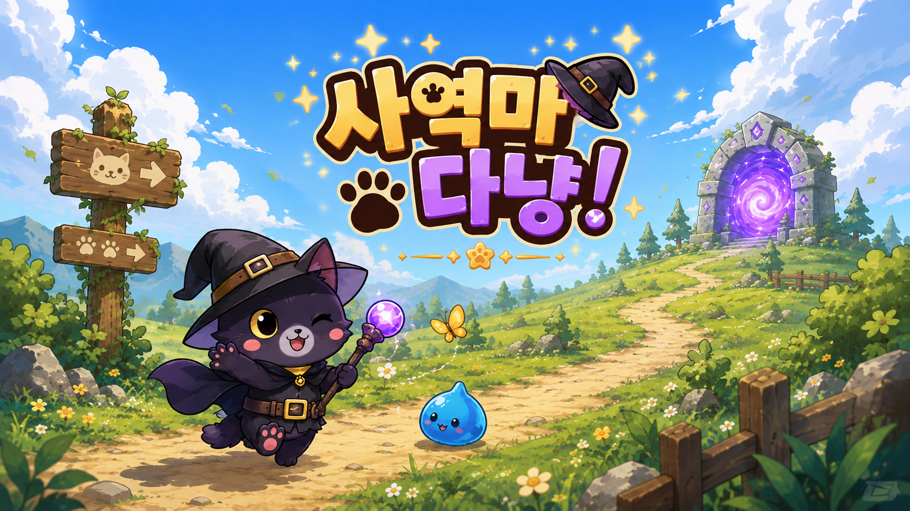
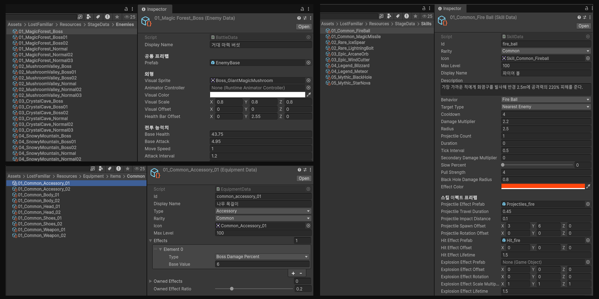
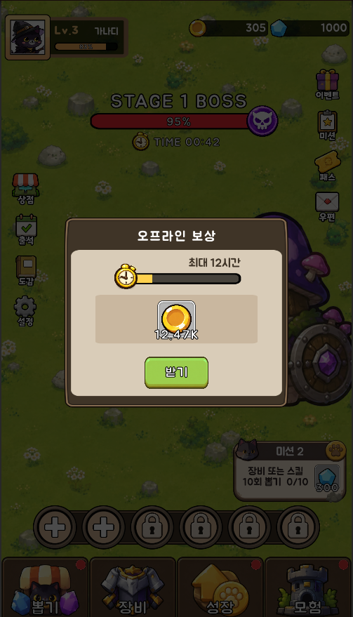
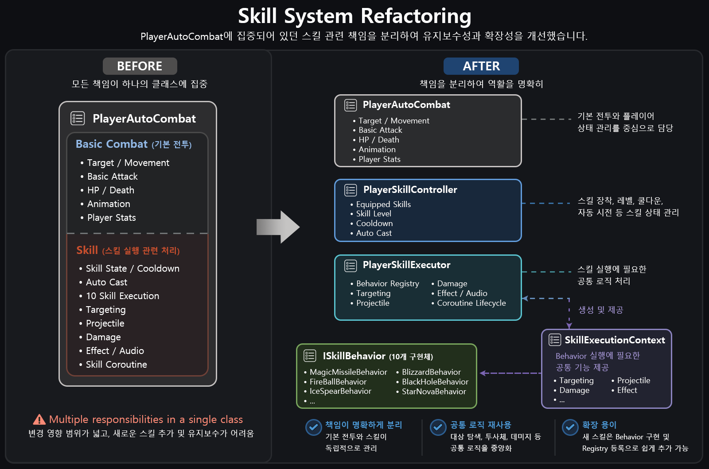

# LostFamiliar

<p align="center">
  
</p>

<p align="center">
  <b>마녀와 헤어진 사역마 고양이가 마력의 조각을 모으며 모험하는 모바일 방치형 RPG</b>
</p>

<p align="center">
  <b>Unity 6 · C# · Android · Solo Project</b>
</p>

---

## 📌 프로젝트 소개

**LostFamiliar**는 자동 전투와 캐릭터 성장을 중심으로 제작한 모바일 방치형 RPG입니다.

마녀의 차원 이동 마법 실험 중 발생한 사고로 낯선 세계에 떨어진 사역마 고양이가  
마녀에게 배운 마법으로 몬스터와 전투하며, 각 지역에 흩어진 **마력의 조각**을 모아  
다시 주인의 곁으로 돌아가는 것을 목표로 합니다.

| 항목 | 내용 |
| --- | --- |
| 개발 형태 | 개인 프로젝트 (1인 개발) |
| 개발 기간 | 2026.07.10 ~ 2026.08.09 |
| 리팩터링 | 개발 완료 후 4일간 진행 |
| 플랫폼 | Android |
| 엔진 | Unity 6.0.76f1 |
| 언어 | C# |

---

## 🎮 주요 콘텐츠

- **자동 전투** — 가장 가까운 적을 탐색하여 자동 이동 및 공격, 스킬 자동 사용
- **스테이지 / 보스전** — 지역별 스테이지 진행과 제한 시간 기반 보스 전투
- **캐릭터 성장** — 공격력, 치명타, 스킬 피해, 보스 피해 등의 단계별 강화
- **장비** — 5개 등급의 장비 수집, 중복 강화, 장착 효과, 보유 효과 및 자동 장착
- **스킬** — 10종의 전투 스킬, 최대 6개 장착, 자동 발동 및 쿨타임 관리
- **가챠** — 장비·장신구·스킬·무기 카테고리별 소환 및 소환 레벨 시스템
- **가이드 미션** — 게임 진행에 따른 단계별 미션과 보상
- **탑 콘텐츠** — 골드 / 젬 탑, 제한 시간, 등급 평가, 소탕 및 입장권 시스템
- **저장 / 방치 보상** — JSON 기반 저장 및 최대 12시간의 오프라인 진행 보상

---

# 🛠 핵심 구현

방치형 RPG의 핵심 플레이 루프를 중심으로  
**자동 전투 → 스테이지 진행 → 성장 → 콘텐츠 확장 → 저장 및 방치 보상**으로 이어지는 구조를 구현했습니다.

---

## 1. 자동 전투 및 Stage / Boss 진행

<p align="center">
  
</p>

플레이어가 직접 조작하지 않아도 전투가 지속되는 방치형 RPG의 전투 흐름을 구현했습니다.

`PlayerAutoCombat`이 주변의 가장 가까운 적을 탐색하고 현재 타겟이 사망하기 전까지 유지하며, 공격 사거리까지 자동으로 이동한 뒤 기본 공격과 스킬을 사용합니다.

전투의 전체 진행 상태는 `MainBattleLoop`에서 관리하며 일반 스테이지 진행과 보스전 진입 및 종료 흐름을 제어합니다.

### 주요 구현

- 가장 가까운 적 자동 탐색 및 타겟 유지
- 공격 사거리까지 자동 이동 후 기본 공격
- 이동 방향에 따른 Sprite Flip
- 기본 공격의 다중 적 피해 처리
- 몬스터 처치에 따른 경험치 및 재화 보상
- Stage 진행도에 따른 적 생성 및 난이도 증가
- Stage Gauge 완료 시 Boss Battle 전환
- Boss Battle 45초 제한 및 승리 / 패배 / 시간 초과 처리
- 플레이어 HP 및 사망 상태 처리

전투의 개별 행동은 `PlayerAutoCombat`, 적의 생명주기는 `EnemyActor`, 스테이지와 보스전의 전체 흐름은 `MainBattleLoop`가 담당하도록 역할을 구분했습니다.

```text
MainBattleLoop
 ├─ Stage 진행
 ├─ Enemy Spawn
 ├─ Boss Battle 전환
 ├─ 보상 및 진행 상태
 └─ PlayerAutoCombat
      ├─ Target 탐색
      ├─ 이동
      ├─ 기본 공격
      └─ Skill System 호출

EnemyActor
 ├─ HP
 ├─ 이동 / 공격
 ├─ 피격
 └─ 사망
```

### Boss Battle

Stage Gauge가 완료되면 일반 전투에서 보스전으로 전환되며, 제한 시간 내 보스를 처치하지 못하거나 플레이어가 사망하면 일반 전투로 복귀합니다.

<p align="center">
  
  &nbsp;&nbsp;
  
</p>

**관련 코드**

- [`MainBattleLoop.cs`](Assets/LostFamiliar/Scripts/Battle/MainBattleLoop.cs) — 스테이지 및 보스전 진행 관리
- [`PlayerAutoCombat.cs`](Assets/LostFamiliar/Scripts/Battle/PlayerAutoCombat.cs) — 플레이어 자동 이동 및 기본 전투
- [`EnemyActor.cs`](Assets/LostFamiliar/Scripts/Battle/EnemyActor.cs) — 적 전투 및 생명주기

---

## 2. 확장 가능한 Skill 실행 구조

<p align="center">
  
</p>

10종의 스킬을 실제 자동 전투에 연결하고, 최대 6개의 스킬을 장착하여 쿨타임에 따라 자동으로 사용할 수 있도록 구현했습니다.

스킬 시스템은 **상태 관리 / 공통 실행 기능 / 개별 스킬 행동**으로 책임을 분리했습니다.

```text
PlayerAutoCombat
       │
       ▼
PlayerSkillController
 ├─ 장착 스킬
 ├─ 스킬 레벨
 ├─ 쿨타임
 └─ 자동 발동 판단
       │
       ▼
PlayerSkillExecutor
 ├─ Behavior Registry
 ├─ Targeting
 ├─ Projectile
 ├─ Damage
 ├─ Effect / Audio
 └─ Coroutine
       │
       ▼
ISkillBehavior
 ├─ MagicMissileBehavior
 ├─ FireBallBehavior
 ├─ IceSpearBehavior
 ├─ LightningBoltBehavior
 ├─ ArcaneOrbBehavior
 ├─ WindCutterBehavior
 ├─ MeteorBehavior
 ├─ BlizzardBehavior
 ├─ BlackHoleBehavior
 └─ StarNovaBehavior
```

`PlayerSkillController`는 장착 상태, 스킬 레벨, 쿨타임과 자동 발동 여부를 관리합니다.

`PlayerSkillExecutor`는 Targeting, Projectile, Damage, Effect / Audio 등 스킬 실행에 필요한 공통 기능을 담당하며 각 스킬에서 재사용합니다.

각 스킬의 고유한 실행 과정은 `ISkillBehavior` 구현체로 분리했습니다.

또한 `SkillExecutionContext`를 통해 각 Behavior가 `PlayerSkillExecutor` 전체에 직접 의존하지 않고 실행에 필요한 공통 기능을 전달받도록 구성했습니다.

이를 통해 새로운 스킬을 추가할 때 기존 전투 코드의 수정 범위를 줄이고, 개별 스킬의 실행 로직을 독립적으로 관리할 수 있도록 했습니다.

> 해당 구조는 초기 개발 당시 `PlayerAutoCombat`에 집중되어 있던 스킬 실행 책임을 개발 완료 후 리팩터링한 결과입니다. 자세한 과정은 아래 **문제 해결 및 리팩터링**에서 다룹니다.

**관련 코드**

- [`PlayerSkillController.cs`](Assets/LostFamiliar/Scripts/Skill/PlayerSkillController.cs) — 스킬 상태 및 자동 발동 관리
- [`PlayerSkillExecutor.cs`](Assets/LostFamiliar/Scripts/Skill/PlayerSkillExecutor.cs) — 스킬 공통 실행 기능
- [`ISkillBehavior.cs`](Assets/LostFamiliar/Scripts/Skill/Execution/ISkillBehavior.cs) — 개별 스킬 실행 인터페이스
- [`SkillExecutionContext.cs`](Assets/LostFamiliar/Scripts/Skill/Execution/SkillExecutionContext.cs) — Behavior 실행 Context
- [`BlackHoleBehavior.cs`](Assets/LostFamiliar/Scripts/Skill/Execution/BlackHoleBehavior.cs) — 개별 Skill Behavior 구현 예시

---

## 3. ScriptableObject 기반 데이터 관리

<p align="center">
  
</p>

장비, 스킬, 적, 보스, 지역 등의 게임 데이터를 `ScriptableObject` 기반으로 관리하여 게임 로직과 콘텐츠 데이터를 분리했습니다.

| 데이터 | 수량 |
| :--- | ---: |
| Equipment | 50 |
| Skill | 10 |
| Normal Enemy | 15 |
| Boss | 15 |
| Region | 5 |

장비 데이터에는 등급, 장비 타입, 기본 능력치, 보유 효과 및 장착 효과 등의 정보를 저장합니다.

스킬 데이터에서는 아이콘, 쿨타임, 데미지 계수 및 실행 Behavior 등의 정보를 관리합니다.

적과 보스 데이터 역시 Prefab과 전투 능력치를 데이터로 분리하여 동일한 전투 시스템에서 서로 다른 콘텐츠를 사용할 수 있도록 구성했습니다.

```text
ScriptableObject Data
│
├─ EquipmentData
│   ├─ Grade
│   ├─ Equipment Type
│   ├─ Stat
│   └─ Effect
│
├─ SkillData
│   ├─ Cooldown
│   ├─ Damage
│   ├─ Behavior
│   └─ Effect
│
├─ EnemyData
│   ├─ Prefab
│   ├─ HP
│   ├─ Attack
│   └─ Reward
│
└─ RegionData
    ├─ Background
    ├─ Enemy Pool
    └─ Boss
```

콘텐츠 수치나 데이터 구성을 수정할 때 전투 로직 자체를 직접 변경하는 범위를 줄이고, Inspector에서 데이터를 편집할 수 있도록 구성했습니다.

**관련 코드**

- [`EquipmentData.cs`](Assets/LostFamiliar/Scripts/Equipment/EquipmentData.cs) — 장비 데이터 정의
- [`SkillData.cs`](Assets/LostFamiliar/Scripts/Skill/SkillData.cs) — 스킬 데이터 정의
- [`BattleData.cs`](Assets/LostFamiliar/Scripts/Battle/BattleData.cs) — Enemy 데이터 및 전투 관련 데이터 정의
- [`RegionData.cs`](Assets/LostFamiliar/Scripts/Stage/RegionData.cs) — 지역 데이터 정의

---

## 4. Save System / Offline Reward

<p align="center">
  
</p>

`PlayerPrefs + JSON` 기반으로 게임 진행 상태를 저장하도록 구현했습니다.

게임 진행 데이터는 `GameSaveData`에 모으고, `SaveService`가 JSON 직렬화 및 PlayerPrefs 저장 / 로드를 담당합니다.

```text
Game State
    │
    ▼
GameSaveData
    │
    ▼
SaveService
    │
    ├─ JsonUtility
    └─ PlayerPrefs
```

### 저장 데이터

- Stage 및 Player 진행도
- Gold / Gem
- 캐릭터 강화 상태
- Equipment 보유 / 강화 / 장착 상태
- Skill 보유 / 강화 / 장착 상태
- Gacha Level / Gauge
- Guide Mission 진행 상태
- Tower 진행 상태 및 입장권

10초 간격의 자동 저장과 Application Pause / Quit 시 저장을 적용했습니다.

마지막 저장 시각을 기준으로 오프라인 시간을 계산하여 최대 **12시간**까지 방치 보상을 지급합니다.

오프라인 보상은 실제 플레이의 예상 몬스터 처치 속도를 기준으로 계산하고, 온라인 전투 대비 **30% 효율**을 적용하여 방치 진행이 직접 플레이를 완전히 대체하지 않도록 구성했습니다.

저장 데이터 로드 과정에서 예외가 발생하면 게임 실행이 중단되지 않도록 초기 데이터로 복구하고, 개발 과정에서 원인을 확인할 수 있도록 Warning Log를 남기도록 처리했습니다.

**관련 코드**

- [`GameSaveData.cs`](Assets/LostFamiliar/Scripts/Save/GameSaveData.cs) — 저장 데이터 구조
- [`SaveService.cs`](Assets/LostFamiliar/Scripts/Save/SaveService.cs) — JSON 직렬화 및 저장 / 로드
- [`OfflineRewardSystem.cs`](Assets/LostFamiliar/Scripts/Progression/OfflineRewardSystem.cs) — 오프라인 보상 계산

---

## 5. Additive Scene 기반 Tower Battle

<p align="center">
  
</p>

메인 스테이지 전투와 별도로 `Gold Tower` / `Gem Tower` 콘텐츠를 구현했습니다.

Tower 전투는 `TowerBattleScene`을 **Additive Scene**으로 로드하여 기존 `MainScene`의 게임 진행 데이터를 유지하면서 별도의 전투 환경을 구성합니다.

```text
MainScene
 └─ Main Combat Group
        │
        │ Additive Load
        ▼
TowerBattleScene
 └─ Tower Combat Group
```

메인 전투와 Tower 전투의 Player / Enemy가 서로를 타겟으로 인식하지 않도록 Combat Group을 분리했습니다.

Tower에서는 별도의 Player, Enemy, Camera 및 Skill UI를 사용하고, 전투 종료 후 `TowerBattleScene`만 Unload하여 기존 MainScene으로 복귀합니다.

### Tower 시스템

- Gold Tower / Gem Tower
- 일일 입장권 각각 2개
- 30초 제한 전투
- S / A / B / C 등급 평가
- A등급 이상 클리어 시 소탕 가능
- S등급 최초 클리어 시 보상 1.5배
- 실패 시 입장권 반환
- Main / Tower Combat Group 분리
- Additive Scene Load / Unload

이를 통해 별도의 게임 진행 Scene을 새로 시작하지 않고도 MainScene의 플레이 상태를 유지한 채 독립적인 전투 콘텐츠를 구성했습니다.

**관련 코드**

- [`TowerBattleController.cs`](Assets/LostFamiliar/Scripts/Tower/TowerBattleController.cs) — Tower 전투 진행
- [`TowerSystem.cs`](Assets/LostFamiliar/Scripts/Tower/TowerSystem.cs) — Tower 진행 데이터 및 입장 관리
- [`AdventureTowerPopupController.cs`](Assets/LostFamiliar/Scripts/Tower/AdventureTowerPopupController.cs) — Tower 진입 UI

---

# 🔧 문제 해결 및 리팩터링

## Skill System 책임 분리

게임 개발 초기에는 빠르게 기능을 구현하는 것을 우선하여 플레이어 전투 기능을 `PlayerAutoCombat`을 중심으로 구현했습니다.

스킬의 종류가 10개까지 증가하면서 `PlayerAutoCombat`이 기본 전투뿐만 아니라 스킬의 세부 실행까지 담당하게 되었고, 클래스의 책임과 스킬 간 공통 로직이 점차 증가했습니다.

### Before → After

<p align="center">
  
</p>

### 문제점

초기 구조에서는 기본 전투와 스킬 실행에 관한 여러 책임이 하나의 클래스에 집중되어 있었습니다.

```text
PlayerAutoCombat
│
├─ Target 탐색
├─ 이동
├─ 기본 공격
├─ HP / 사망
├─ Animation
├─ Player Stat
│
├─ Skill 자동 사용
├─ Skill Cooldown
├─ 10종 Skill 실행
├─ Projectile 생성
├─ 범위 Targeting
├─ Skill Damage
└─ Skill Effect
```

새로운 스킬을 추가할수록 `PlayerAutoCombat` 내부의 스킬 관련 코드가 계속 증가했고 다음과 같은 문제가 있었습니다.

- 기본 전투와 스킬 실행 책임이 하나의 클래스에 집중
- 새로운 스킬 추가 시 기존 `PlayerAutoCombat`을 계속 수정해야 함
- 스킬별 고유 로직과 공통 실행 로직의 경계가 불명확
- 스킬 Coroutine과 기본 전투 Coroutine의 생명주기가 같은 객체에서 관리됨
- 스킬 수가 증가할수록 코드 탐색과 변경 영향 범위가 함께 증가

### 개선 방향

스킬 시스템을 무조건 작은 클래스로 세분화하기보다는 다음 세 가지 책임을 기준으로 구조를 나눴습니다.

```text
스킬 상태 / 자동 발동 판단
          ↓
스킬 실행을 위한 공통 기능
          ↓
각 스킬의 고유 행동
```

이를 기준으로 `PlayerSkillController`, `PlayerSkillExecutor`, `ISkillBehavior`를 분리했습니다.

### Behavior Registry

스킬 종류에 따라 실행 코드를 직접 분기하는 방식 대신 `SkillBehavior`와 `ISkillBehavior` 구현체를 Registry로 연결했습니다.

```text
SkillBehavior
      │
      ▼
Behavior Registry
      │
      ├─ MagicMissile → MagicMissileBehavior
      ├─ FireBall     → FireBallBehavior
      ├─ IceSpear     → IceSpearBehavior
      └─ ...
```

이를 통해 새로운 스킬을 추가할 때 기존의 큰 실행 분기를 계속 확장하는 대신 해당 스킬의 Behavior를 구현하고 Registry에 등록할 수 있도록 변경했습니다.

### SkillExecutionContext

각 `ISkillBehavior`가 `PlayerSkillExecutor` 전체에 강하게 의존하지 않도록 `SkillExecutionContext`를 통해 스킬 실행에 필요한 공통 기능을 전달합니다.

```text
PlayerSkillExecutor
        │
        │ 생성 및 제공
        ▼
SkillExecutionContext
        │
        ▼
ISkillBehavior
 ├─ Targeting
 ├─ Damage
 ├─ Projectile
 ├─ Effect / Audio
 └─ Coroutine
```

Behavior는 스킬의 고유한 실행 순서에 집중하고, 공통적인 전투 처리는 Context를 통해 재사용하도록 구성했습니다.

### Coroutine 생명주기 분리

기존에는 스킬 Coroutine도 `PlayerAutoCombat`에서 실행되어 전투 Coroutine과 스킬 Coroutine의 생명주기가 같은 객체에 묶여 있었습니다.

리팩터링 후 스킬 Coroutine은 `PlayerSkillExecutor`가 관리하도록 변경했습니다.

따라서 스킬 실행을 초기화할 때 `PlayerSkillExecutor.Clear()`가 자신의 Coroutine을 종료하도록 하여 플레이어의 다른 전투 Coroutine과 스킬 Coroutine의 생명주기를 분리했습니다.

### 결과

| 클래스 | 책임 |
| --- | --- |
| `PlayerAutoCombat` | 이동, 기본 공격, HP 등 기본 전투 |
| `PlayerSkillController` | 장착 스킬, 레벨, 쿨타임 및 자동 발동 |
| `PlayerSkillExecutor` | 스킬 실행에 필요한 공통 기능 |
| `SkillExecutionContext` | Behavior에 필요한 실행 기능 전달 |
| `ISkillBehavior` | 각 스킬의 고유 실행 로직 |

이를 통해 **기본 전투와 스킬 실행의 결합도를 낮추고, 새로운 스킬을 추가할 때 기존 코드의 수정 범위를 줄였습니다.**

Targeting / Damage / Effect 등을 각각 별도의 Service로 더 분리할 수도 있었지만, 현재 프로젝트의 규모와 스킬 수를 고려했을 때 클래스 수와 구조적 복잡성만 증가할 가능성이 있다고 판단하여 현재 수준에서 분리를 마무리했습니다.

> 구조를 최대한 세분화하는 것보다, 현재 프로젝트 규모에서 책임이 명확하고 새로운 스킬을 추가하기 쉬운 수준을 목표로 리팩터링했습니다.

**관련 코드**

- [`PlayerAutoCombat.cs`](Assets/LostFamiliar/Scripts/Battle/PlayerAutoCombat.cs)
- [`PlayerSkillController.cs`](Assets/LostFamiliar/Scripts/Skill/PlayerSkillController.cs)
- [`PlayerSkillExecutor.cs`](Assets/LostFamiliar/Scripts/Skill/PlayerSkillExecutor.cs)
- [`ISkillBehavior.cs`](Assets/LostFamiliar/Scripts/Skill/Execution/ISkillBehavior.cs)
- [`SkillExecutionContext.cs`](Assets/LostFamiliar/Scripts/Skill/Execution/SkillExecutionContext.cs)

---
